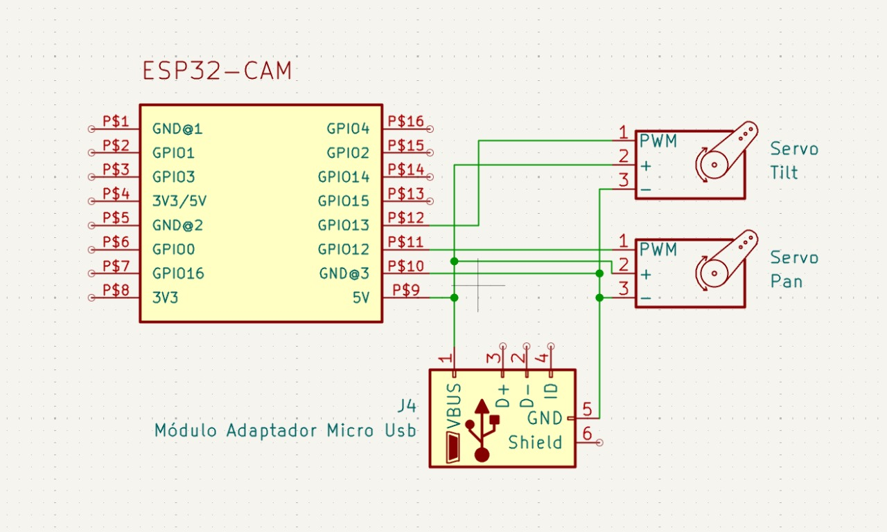

# Câmera de Rastreamento Facial com ESP32-CAM e Python

Projeto final para a disciplina de Automação e Controle.

## Arquitetura e Funcionamento do Sistema

Este projeto opera em uma arquitetura distribuída que separa o processamento de imagem do controle físico, uma estratégia essencial para obter um desempenho em tempo real com hardware embarcado. O sistema pode ser entendido como um "cérebro" (o script Python) que comanda um "corpo" remoto (o ESP32-CAM).

O fluxo de controle e dados ocorre da seguinte forma:

1.  **Aquisição e Streaming de Vídeo (O "Olho" do Sistema):**
    * O **ESP32-CAM** atua como um servidor de aquisição dedicado. [cite_start]Utilizando a biblioteca `esp_http_server`, ele cria um web server que transmite um fluxo de vídeo contínuo no formato `multipart/x-mixed-replace` através do endpoint `/stream`[cite: 1, 7, 18]. Sua única tarefa é fornecer a visão do ambiente para o cérebro.

2.  **Processamento e Tomada de Decisão (O "Cérebro" do Sistema):**
    * O **Script Python** em um computador consome o stream de vídeo via HTTP. Para cada quadro recebido, ele realiza a tarefa computacionalmente intensiva:
        * **Visão Computacional:** Usando a biblioteca OpenCV, o rosto é detectado com um classificador Haar Cascade (`haarcascade_frontalface_default.xml`).
        * **Lógica de Controle Proporcional:** O script calcula o vetor de erro, que é a diferença em pixels entre o centro do rosto e o centro da imagem. Este erro serve de entrada para a lei de controle Proporcional, cuja ação de controle é diretamente proporcional ao erro medido.

3.  **Atuação e Fechamento da Malha (O "Corpo" em Ação):**
    * **Transmissão de Comandos:** O resultado do cálculo de controle é enviado de volta ao ESP32. Essa comunicação é feita via **UDP** para garantir baixíssima latência, enviando uma string formatada.
    * [cite_start]**Execução do Movimento:** No ESP32, um listener da biblioteca `AsyncUDP` aguarda esses pacotes na porta 12345[cite: 4, 5, 27]. [cite_start]Ao receber um comando, ele o processa e atualiza a posição dos servos de Pan [cite: 28] [cite_start]e Tilt[cite: 29], movendo fisicamente a câmera e fechando o ciclo de controle.
